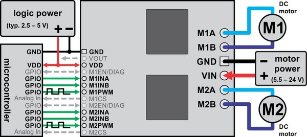
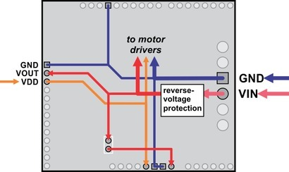
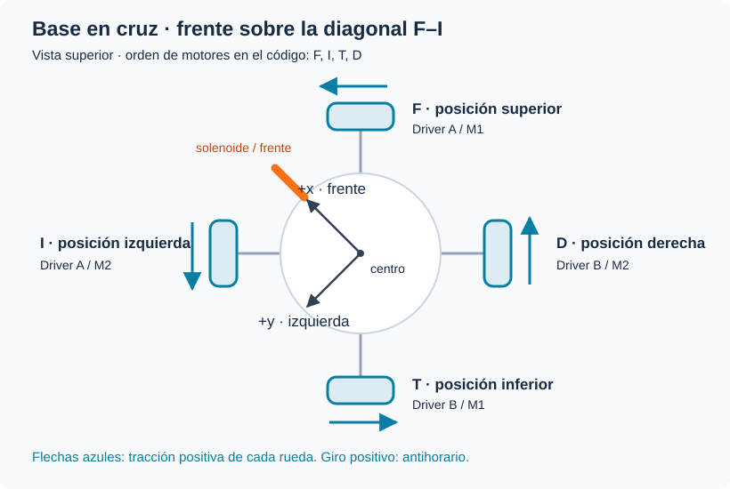

# Pololu Dual VNH5019 + ESP32

Control de motores para la base omnidireccional con **ESP32 DevKit V1
(ESP32-WROOM-32)** y dos **Pololu Dual VNH5019**. El repositorio conserva cuatro
etapas independientes: el control base PPM, la versión con solenoide y dos
variantes de control orientado al campo mediante IMU.

- [Prueba de M1 por serial](arduino/esp32_motor1/esp32_motor1.ino)
- [Control híbrido e IMU](docs/imu-hibrido.md)
- [Manual del driver (PDF)](dual_vnh5019_motor_driver_shield.PDF)

## Versiones disponibles

Cada carpeta es un sketch autónomo. Abrir el `.ino` cuyo nombre coincide con la
carpeta; no mezclar headers entre variantes.

| Variante | Sketch | Función |
| --- | --- | --- |
| Control base PPM | [`esp32_omni4_base`](arduino/esp32_omni4_base/esp32_omni4_base.ino) | Cuatro motores por PPM y CH5 como habilitación general |
| Solenoide, sin IMU | [`esp32_omni4_rc`](arduino/esp32_omni4_rc/esp32_omni4_rc.ino) | Cableado actual; CH5 dispara GPIO 13 y los motores dependen sólo de PPM/DIAG |
| BNO055 | [`esp32_omni4_bno055`](arduino/esp32_omni4_bno055/esp32_omni4_bno055.ino) | Traslación orientada al campo, rumbo retenido, CH5 solenoide y CH6 selector 0°/180° |
| MPU6050 | [`esp32_omni4_mpu6050`](arduino/esp32_omni4_mpu6050/esp32_omni4_mpu6050.ino) | Mismo control híbrido, con yaw obtenido por integración del giroscopio |

El control base conserva el comportamiento mínimo de movimiento por PPM. La
variante siguiente sustituye la habilitación de CH5 por el pulso temporizado del
solenoide, todavía sin control de orientación.

Las dos variantes con IMU definen como **0°** la orientación física presente al
encender. CH3/CH4 ordenan traslación respecto al campo, CH1 desplaza la referencia
angular y al soltarlo el controlador mantiene el último rumbo. CH6 funciona por
transición: extremo alto selecciona 0°, centro no cambia nada y extremo bajo
selecciona 180°. La posición inicial de CH6 no genera una orden.

El BNO055 opera en `IMUPLUS`, sin magnetómetro, para reducir perturbaciones por
motores y corrientes altas. El MPU6050 calibra el sesgo al arrancar e integra
`gyro.z`; es más básico y acumulará más deriva. Ambos requieren que el robot esté
inmóvil y orientado hacia la portería durante el encendido.

Las APIs utilizadas corresponden a las librerías oficiales
[Adafruit BNO055](https://github.com/adafruit/Adafruit_BNO055) y
[Adafruit MPU6050](https://github.com/adafruit/Adafruit_MPU6050). Se instalan
desde Arduino Library Manager junto con **Adafruit Unified Sensor** y
**Adafruit BusIO**.

## Configuración sin IMU: DevKit V1, PPM y solenoide

Los números siguientes son **GPIO**, no posiciones físicas del conector. Esta
asignación corresponde al DevKit V1 con módulo ESP32-WROOM-32.

| Función | GPIO | Conexión |
| --- | ---: | --- |
| Entrada PPM compuesta | 27 | Salida PPM del receptor, adaptada a 3.3 V |
| Motor 1 INA / INB / PWM | 5 / 18 / 22 | Driver A, canal M1 |
| Motor 2 INA / INB / PWM | 17 / 19 / 25 | Driver A, canal M2 |
| Motor 3 INA / INB / PWM | 26 / 21 / 14 | Driver B, canal M1 |
| Motor 4 INA / INB / PWM | 32 / 33 / 23 | Driver B, canal M2 |
| EN/DIAG compartido | 16 | EN/DIAG de los canales utilizados |
| Mando de solenoide | 13 | Entrada de una etapa de potencia, activa en HIGH |

VDD de los VNH5019 se conecta a 3V3 y todas las tierras deben ser comunes. El
GPIO 5 es un pin de arranque (*strapping*): no agregarle una resistencia o una
carga que fuerce un nivel incompatible durante el reset. GPIO 27 recibe como
máximo 3.3 V; si la salida PPM del receptor es de 5 V debe usarse un adaptador
de nivel.

### Cómo se lee PPM

Sólo se utiliza **un cable de señal** entre el receptor y GPIO 27. `PPM.h`
registra por interrupción cada flanco ascendente. El tiempo entre flancos, en
microsegundos, representa el valor consecutivo de cada canal; un intervalo
mayor de 3000 µs delimita la trama. Se aceptan intervalos de canal entre 800 y
2200 µs y se almacenan hasta seis canales.

El programa exige al menos cinco canales y considera perdida la señal si no
recibe una trama válida durante 100 ms. En ese caso pone en cero los cuatro
motores y apaga el solenoide. El mapeo comprobado en el código compartido es:

| Canal PPM | Uso actual | Índice en `canales[]` |
| --- | --- | ---: |
| CH1 | Giro | 0 |
| CH2 | Recibido y mostrado; no interviene en el control | 1 |
| CH3 | Avance / reversa | 2 |
| CH4 | Movimiento lateral | 3 |
| CH5 | Disparo del solenoide por cambio de estado | 4 |

Por tanto, no son cinco entradas PWM independientes ni hay cuatro canales de
movimiento: se decodifican cinco canales de una trama PPM, pero actualmente hay
tres ejes de movimiento, un switch y un canal sin usar.

### Pulso del solenoide por cambio de CH5

CH5 ya no habilita o deshabilita los motores. Los valores menores de 1300 µs se
interpretan como un estado y los mayores de 1700 µs como el otro; la zona
intermedia no cambia el estado registrado. Cada transición **OFF→ON u ON→OFF**
activa GPIO 13 durante `PULSO_SOLENOIDE_MS`, inicialmente **150 ms**, y después
lo apaga automáticamente aunque la palanca permanezca en su nueva posición.

El primer estado válido después del arranque o de una pérdida de señal sólo se
usa como referencia y no dispara el solenoide. Esto evita golpes involuntarios
al encender o reconectar el receptor. Cambiar `PULSO_SOLENOIDE_MS` únicamente
después de confirmar el tiempo permitido por el solenoide y el mecanismo.

**No conectar una bobina ni un relé desnudo directamente al ESP32.** GPIO 13
debe mandar un MOSFET lógico o un módulo de relevador compatible con lógica de
3.3 V. Una bobina DC requiere diodo de rueda libre colocado en paralelo con la
bobina, alimentación separada dimensionada para su corriente y tierra común
con el ESP32. Si el módulo es activo en LOW, cambiar
`SOLENOIDE_ACTIVO_EN_HIGH` a `false`.

## Configuración con BNO055 o MPU6050

Las IMU usan I²C en GPIO 21/22. Como esos pines pertenecían a señales de motor,
las dos variantes IMU requieren este cambio de cableado:

| Función | Sin IMU | Con IMU |
| --- | ---: | ---: |
| M1 PWM | GPIO 22 | GPIO 4 |
| M3 INB | GPIO 21 | GPIO 2 |
| SDA | — | GPIO 21 |
| SCL | — | GPIO 22 |

PPM permanece en GPIO 27, el solenoide en GPIO 13 y EN/DIAG en GPIO 16. GPIO 2
y GPIO 4 son pines de arranque: sólo se conectan a las entradas de alta
impedancia del VNH5019, sin pull-ups adicionales. El procedimiento completo de
montaje, signos y ajuste del controlador está en
[Control híbrido orientado al campo](docs/imu-hibrido.md).

## Hardware de la prueba de M1

- ESP32 DevKit con módulo ESP32-WROOM-32.
- Pololu Dual VNH5019.
- Motor DC con escobillas.
- Fuente compatible con el voltaje y la corriente del motor.
- Cable USB y conexiones para señales y potencia.

Este pinout corresponde al ESP32 original; no se debe trasladar directamente
a un ESP32-C3 o ESP32-S3.

## Conexiones de la prueba de M1



*Diagrama general de Pololu, manual p. 20. Muestra ambos canales; este programa
utiliza únicamente M1. Para el ESP32, VDD se conecta a 3.3 V. Las conexiones
específicas se indican en la tabla siguiente.*

### ESP32 → driver

Usar los nombres impresos en el header lateral del driver. Los números de la
tabla son **GPIO**, no posiciones físicas del conector del ESP32.

| ESP32 | VNH5019 | Función |
| --- | --- | --- |
| 3V3 | VDD | Alimentación de los pull-ups de EN/DIAG |
| GND | GND | Tierra común |
| GPIO 25 | M1INA | Sentido de giro, entrada A |
| GPIO 26 | M1INB | Sentido de giro, entrada B |
| GPIO 27 | M1PWM | PWM del motor 1 |
| GPIO 32 | M1EN/DIAG | Habilitación y lectura de falla del motor 1 |
| GPIO 18 | M2INA | Entrada A del motor 2, mantenida en LOW |
| GPIO 19 | M2INB | Entrada B del motor 2, mantenida en LOW |
| GPIO 23 | M2PWM | PWM del motor 2, mantenido en LOW |
| GPIO 33 | M2EN/DIAG | Motor 2 deshabilitado con LOW |

GPIO 32 debe estar conectado: el programa lo usa como salida LOW para
deshabilitar M1 y como entrada para liberar la habilitación y leer fallas.
El nivel HIGH lo establece el pull-up del driver a VDD; no se fuerza desde el ESP32.
Las entradas de control del VNH5019 aceptan lógica de 3.3 V.

### Alimentación y motor

| Conexión | Terminal del driver |
| --- | --- |
| Positivo de la fuente del motor | VIN grande |
| Negativo de la fuente del motor | GND grande |
| Terminales del motor 1 | M1A y M1B |
| Motor 2 | Sin conectar |
| VOUT, M1CS y M2CS | Sin conectar |



*Distribución de alimentación, manual de Pololu p. 22. VOUT corresponde a la
alimentación del motor después de la protección de polaridad; no es una salida
regulada de 3.3 V.*

- Quitar el jumper **ARDVIN=VOUT**.
- Alimentar el ESP32 por USB y el driver por las terminales grandes VIN/GND.
- Conectar las tierras de ESP32, driver y fuente del motor.
- Llevar la corriente del motor por cable y terminales adecuados, no por el ESP32
  ni por un protoboard.
- El driver admite 5.5–24 V. Pololu no recomienda baterías de 24 V nominales:
  cargadas pueden superar ese voltaje y activar la protección.
- Dejar las salidas de corriente M1CS/M2CS desconectadas. Pueden superar 3.3 V;
  no se usan en este programa.

El manual especifica hasta 12 A por canal, condicionado por la disipación térmica,
y 30 A pico. Las terminales incluidas tienen una capacidad nominal de 16 A.
La selección de fuente, motor y cableado debe considerar la corriente de arranque
y de bloqueo, no solamente la corriente sin carga. Ver pp. 9 y 14–15 del manual.

## Cargar el programa

1. Instalar **esp32 by Espressif Systems**, versión **3.x**, desde el administrador
   de placas de Arduino IDE.
2. Abrir [`esp32_motor1.ino`](arduino/esp32_motor1/esp32_motor1.ino).
3. Seleccionar la placa correspondiente al ESP32-WROOM-32; normalmente
   **ESP32 Dev Module**, y el puerto USB.
4. Cargar el programa. No requiere la librería de Pololu.
5. Abrir el monitor serial a **115200 baud**, con **Nueva línea** o **Ambos NL y CR**.

Al iniciar, M1 permanece deshabilitado y el duty configurado es 30%.
La salida serial muestra:

```text
M1 detenido. Duty: 30%.
adelante | atras | parar | duty 0..100 | estado | ayuda
```

## Comandos seriales

Enviar un comando por línea. Se aceptan mayúsculas y minúsculas.

| Comando | Resultado |
| --- | --- |
| `adelante` | Selecciona avance: INA=HIGH, INB=LOW |
| `atras` | Selecciona reversa: INA=LOW, INB=HIGH |
| `duty 60` | Configura el duty al 60%; admite enteros de 0 a 100 |
| `parar` o `s` | Deshabilita M1 y cancela el movimiento pendiente |
| `estado` | Muestra dirección solicitada, duty, PWM aplicado, espera y falla |
| `ayuda` | Muestra los comandos |

“Avance” y “reversa” dependen de cómo estén conectados los cables del motor;
no indican un sentido horario absoluto.

Ejemplo de operación, enviando cada línea cuando corresponda:

```text
duty 40
adelante
estado
duty 60
atras
parar
```

Cambiar el duty mientras está detenido no lo arranca por sí solo. Si ya se envió
un comando de dirección, un duty mayor que cero habilita el movimiento en ese
sentido. Durante el giro, el nuevo duty se aplica con una rampa.

`duty 0` ejecuta un paro y borra la dirección solicitada. Para volver a moverlo,
configurar un duty mayor que cero y enviar `adelante` o `atras`.

En `estado`, la dirección vale `0` para detenido, `1` para avance y `-1` para
reversa. Es el estado solicitado al programa, no una medición del movimiento.
El PWM aplicado se muestra en la escala 0–255.

## PWM y rampas de M1

La configuración está al inicio del sketch:

```cpp
const uint32_t FRECUENCIA_PWM = 20000;
const uint32_t PASO_RAMPA_MS = 10;
const uint32_t PAUSA_CAMBIO_MS = 1000;
```

La frecuencia es **20 kHz**, con resolución de **8 bits**. El porcentaje enviado
por serial se convierte a una cuenta PWM de 0 a 255 con redondeo:

```cpp
objetivo = (dutyPorcentaje * 255 + 50) / 100;
```

### Arranque y ajuste de duty

El PWM aplicado se acerca al objetivo **una cuenta cada 10 ms**, tanto al subir
como al bajar. Esto equivale aproximadamente a 39.2 puntos porcentuales de duty
por segundo. El tiempo nominal de la rampa es:

```text
tiempo ≈ |PWM objetivo − PWM inicial| × 10 ms
```

| Cambio solicitado | Cuentas PWM | Tiempo aproximado |
| --- | --- | --- |
| 0 → 30% | 0 → 77 | 0.77 s |
| 0 → 60% | 0 → 153 | 1.53 s |
| 30 → 60% | 77 → 153 | 0.76 s |
| 60 → 20% | 153 → 51 | 1.02 s |
| 0 → 100% | 0 → 255 | 2.55 s |

Son tiempos nominales: el programa usa `millis()` y ejecuta como máximo un paso
por actualización. La carga del loop puede alargarlos; el primer paso también
depende del tiempo transcurrido desde la actualización anterior.
Reducir `PASO_RAMPA_MS` acelera la rampa; aumentarlo la hace más lenta.

### Cambio de sentido

Al recibir el sentido contrario, el programa:

1. Deshabilita el puente y lleva el PWM a cero **sin rampa de bajada**.
2. Espera a completar **1000 ms desde el último corte de una salida con PWM activo**.
3. Cambia INA/INB y libera EN/DIAG.
4. Sube desde cero hasta el duty configurado con la misma rampa de 10 ms por cuenta.

Por ejemplo, invertir con duty de 60% toma aproximadamente **1 s de espera +
1.53 s de rampa** para alcanzar el nuevo objetivo. Si antes se envió `parar`,
el tiempo ya transcurrido desde el corte cuenta dentro del segundo de espera.
Durante la espera se siguen procesando comandos; `parar` cancela la inversión.

La espera se ajusta con `PAUSA_CAMBIO_MS`. Es una pausa fija: no hay encoder
para confirmar que el eje ya se detuvo. El tiempo necesario depende del motor,
la inercia y la carga.

### Paro y fallas

`parar`, `s` y `duty 0` cortan la salida inmediatamente, sin rampa ni frenado
activo. El motor queda libre y puede seguir girando por inercia.

Una falla detectada en EN/DIAG durante la operación o un error al configurar o
actualizar el PWM deshabilita M1 y bloquea nuevos comandos de movimiento hasta
reset. Un paro normal sí permite volver a arrancar por serial.

La rampa controla el **duty**, no la velocidad ni la corriente. El programa no
implementa regulación de RPM, límite de corriente por software ni lectura de M1CS.

## Agregar otro motor

Cada canal necesita su propio estado: dirección, PWM actual, referencia y tiempo
de inversión. Para habilitar M2 del primer driver, se conectan sus terminales
M2A/M2B y se usan GPIO 18/19/23/33 de la tabla. Ese canal ya no se mantiene en LOW:
se inicializa otro PWM y se actualiza su rampa en el mismo `loop()`.

La lógica queda separada en tres partes:

1. **Entrada:** serial para pruebas o canales RC para la base completa.
2. **Referencias:** un valor con signo por motor, entre -255 y 255.
3. **Salida:** dirección, rampa, habilitación y falla de cada canal.

No conviene copiar el `loop()` de M1 ni usar esperas bloqueantes por motor. Las
versiones RC usan un arreglo de cuatro motores. La variante sin IMU actualiza el
control cada 2 ms y las variantes con IMU cada 5 ms. Una pérdida de PPM o una
señal baja en EN/DIAG corta los cuatro motores.

## Base omnidireccional en cruz

La base lleva cuatro ruedas omni con tracción tangencial: **F** al frente,
**I** a la izquierda, **T** atrás y **D** a la derecha. El orden en el código
es **F, I, T, D**. Driver A controla F/I y driver B controla T/D.



Tomamos `x` hacia el frente, `y` hacia la izquierda y giro positivo antihorario,
vistos desde arriba. Las flechas azules indican el sentido positivo de tracción
de cada rueda. Los signos eléctricos se ajustan después con `polaridad`.

### Cinemática

Para una rueda en $(x_i,y_i)$, con dirección de tracción unitaria
$\mathbf{t}_i=(t_{ix},t_{iy})$ y radio $r$, la velocidad angular requerida es:

$$
\dot\phi_i = \frac{t_{ix}(v_x-\omega y_i)+t_{iy}(v_y+\omega x_i)}{r}
$$

Con las cuatro ruedas a distancia $L$ del centro:

$$
\begin{bmatrix}
\dot\phi_F\\
\dot\phi_I\\
\dot\phi_T\\
\dot\phi_D
\end{bmatrix}
=\frac{1}{r}
\begin{bmatrix}
0 & 1 & L\\
-1 & 0 & L\\
0 & -1 & L\\
1 & 0 & L
\end{bmatrix}
\begin{bmatrix}v_x\\v_y\\\omega\end{bmatrix}
$$

Aquí $v_x,v_y$ están en m/s, $\omega$ en rad/s, $L,r$ en metros y
$\dot\phi_i$ en rad/s. $L$ se mide al centro de contacto de la rueda.
Si las distancias no son iguales, se usa la posición real de cada rueda en
la expresión general.

| Movimiento positivo | F | I | T | D |
| --- | --- | --- | --- | --- |
| Avance $v_x$ | 0 | − | 0 | + |
| Lateral izquierdo $v_y$ | + | 0 | − | 0 |
| Giro antihorario $\omega$ | + | + | + | + |

Para recuperar la velocidad de la base a partir de velocidades medidas:

$$
v_x=\frac{r}{2}(\dot\phi_D-\dot\phi_I),\qquad
v_y=\frac{r}{2}(\dot\phi_F-\dot\phi_T),\qquad
\omega=\frac{r}{4L}(\dot\phi_F+\dot\phi_I+\dot\phi_T+\dot\phi_D)
$$

Estas relaciones suponen rodadura ideal en la dirección de tracción y libertad
lateral por los rodillos. La derivación sigue la proyección de la velocidad del
chasis sobre cada rueda descrita en
[Modern Robotics, sección 13.2](https://modernrobotics.northwestern.edu/nu-gm-book-resource/13-2-omnidirectional-wheeled-mobile-robots-part-1-of-2/).

### Mezcla de cuatro motores

Por ahora trabajamos en lazo abierto. Los sticks se normalizan a -1…1 y se mezclan:

```text
F =  lateral + giro
I = -avance  + giro
T = -lateral + giro
D =  avance  + giro
```

Los tres ejes entran a la mezcla con ganancia 1. Si alguna salida supera
magnitud 1, se dividen **las cuatro** entre el máximo absoluto para conservar
sus proporciones. Después se aplica `DUTY_MAX = 1.00`, se convierte a 0–255 y
se invierte M2 según la configuración actual. Estas entradas son referencias
normalizadas; todavía no son m/s ni rad/s.

La matriz da velocidades de rueda. Usar su mezcla como duty sirve para empezar,
pero no compensa diferencias entre motores o carga. Para cerrar velocidad,
la salida de la matriz será la referencia de un PI por rueda con encoder.
Los radios, distancias y relación de transmisión se incorporan en esa etapa.

### Receptor y control de cuatro motores

La versión actual usa una sola salida PPM del receptor. La mezcla se aplica
directamente como duty PWM de 20 kHz y 8 bits, con `DUTY_MAX = 1.00`. No usa la
rampa ni la pausa de inversión disponibles en `ControlOmni.h`: un cambio brusco
del stick puede producir un cambio brusco de duty o sentido. La pérdida de PPM
o un nivel bajo en EN/DIAG detiene los cuatro motores de inmediato.

## Archivos y referencias

```text
README.md
arduino/
  README.md
  esp32_motor1/
    esp32_motor1.ino
  esp32_omni4_rc/
    esp32_omni4_rc.ino
    ControlOmni.h
    PPM.h
  esp32_omni4_base/
    esp32_omni4_base.ino
    ControlOmni.h
    PPM.h
  esp32_omni4_bno055/
    esp32_omni4_bno055.ino
    ControlCampo.h
    ControlOmni.h
    PPM.h
  esp32_omni4_mpu6050/
    esp32_omni4_mpu6050.ino
    ControlCampo.h
    ControlOmni.h
    PPM.h
docs/
  omni4.md
  imu-hibrido.md
  images/
    conexiones-driver.jpg
    alimentacion-driver.jpg
    base-cruz.svg
tests/
  README.md
  control_campo_test.cpp
  control_omni_test.cpp
  ppm_test.cpp
  mocks/Arduino.h
dual_vnh5019_motor_driver_shield.PDF
```

- [Manual incluido](dual_vnh5019_motor_driver_shield.PDF), secciones 3.c, 4.b y 8.
- [Conexiones del VNH5019 — Pololu](https://www.pololu.com/docs/0J49/4.b).
- [API LEDC — Espressif](https://docs.espressif.com/projects/arduino-esp32/en/latest/api/ledc.html).

El PDF y los dos diagramas son material de **Pololu Corporation**. Las imágenes
se extrajeron de las páginas 20 y 22 del manual incluido, sin modificar su contenido.
