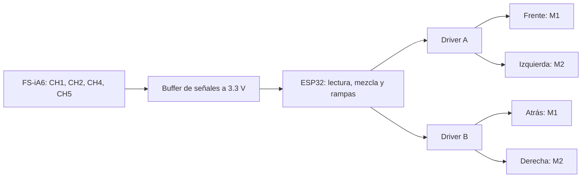

# Cuatro motores con FS-iA6

Borrador para la base en cruz: un ESP32-WROOM-32, dos Pololu Dual VNH5019
y cuatro ruedas omni. El [sketch de M1](../arduino/esp32_motor1/esp32_motor1.ino)
sigue disponible para pruebas por serial. La versión RC está en
[`esp32_omni4_rc`](../arduino/esp32_omni4_rc/esp32_omni4_rc.ino).

## Distribución



Los drivers reciben señales GPIO y PWM; no hay comunicación serial entre ellos
y el ESP32. La radio entrega referencias de movimiento, no una orden por rueda.
La mezcla cinemática se calcula en el ESP32.

## Pinout completo

Los ocho GPIO del primer driver conservan el cableado de la prueba de M1.

| Rueda | Driver / canal | INA | INB | PWM | EN/DIAG |
| --- | --- | --- | --- | --- | --- |
| F: frente | A / M1 | 25 | 26 | 27 | 32 |
| I: izquierda | A / M2 | 18 | 19 | 23 | 33 |
| T: atrás | B / M1 | 4 | 5 | 14 | 13 |
| D: derecha | B / M2 | 16 | 17 | 21 | 22 |

VDD de ambos drivers va a 3V3. Las tierras van en común. Quitar los jumpers
ARDVIN=VOUT de ambas placas y dejar VOUT y las salidas CS sin conectar.
Cada motor se conecta a las dos terminales de su canal; **no se unen las salidas
de los dos drivers**. La fuente de potencia se distribuye a VIN/GND de cada placa.

GPIO 5 es un pin de *strapping*. Aquí sólo se conecta a INB del driver, que es
una entrada de alta impedancia; no agregar un pull-down ni otro dispositivo que
imponga nivel durante reset. Mantener los PWM en LOW durante el arranque.
GPIO 16/17 se usan bajo el supuesto de un **WROOM-32 sin PSRAM**. Revisar el
pinout si se cambia a un módulo WROVER u otra variante.
[Referencia de pines y arranque de Espressif](https://documentation.espressif.com/esp32-wroom-32_datasheet_en.html).

### Receptor

El **FS-iA6** tiene seis salidas PWM y alimentación de **4.0–6.5 V** según
[FlySky](https://www.flysky-cn.com/ia6-canshu). Para este montaje se propone
un regulador de **5 V** para el receptor. VDD de los VNH5019 permanece en 3.3 V.
No alimentar el receptor desde VOUT ni directamente desde la batería de motores.

| FS-iA6 | Función propuesta | ESP32, después del buffer |
| --- | --- | --- |
| CH1, señal | Lateral: izquierda/derecha | GPIO 34 |
| CH2, señal | Avance/reversa | GPIO 35 |
| CH4, señal | Giro sobre el centro | GPIO 36, VP |
| CH5, señal | Switch de habilitación | GPIO 39, VN |
| VCC | Alimentación del receptor | 5 V regulados |
| GND | Referencia de señales | Tierra común |

CH3 y CH6 quedan libres. Se evita usar el canal de acelerador sin resorte para
un eje que necesita regresar al centro. Asignar CH5 a un switch del transmisor
y desactivar mezclas de avión/helicóptero. Confirmar el orden real de canales
con el monitor serial antes de conectar la potencia.

GPIO 34–39 son entradas sin pull-ups/pull-downs internos. Sus señales deben
llegar a **3.3 V**, no asumir que la salida del receptor tiene ese nivel.
La propuesta es un **SN74LVC125A** alimentado a 3.3 V, con entradas tolerantes
hasta 5.5 V y cuatro canales no inversores:

```text
FS-iA6 CHx ── Ax [SN74LVC125A, VCC=3.3 V] Yx ── GPIO
               │
             100 kΩ
               │
              GND

/OE de los cuatro canales → GND
GND del buffer → tierra común
100 nF entre VCC y GND, junto al buffer
```

El pull-down se coloca en cada entrada del buffer para que quede definida si
se desconecta el receptor. Verificar que el componente sea **LVC**, no un
74HC125 alimentado a 3.3 V. La tolerancia de entrada depende de la familia.
[Hoja de datos del SN74LVC125A](https://www.ti.com/lit/ds/symlink/sn74lvc125a.pdf).

## Lectura de canales

`ReceptorPWM.h` mide el tiempo entre flancos con `micros()` y una interrupción
`CHANGE` por canal. No usa `pulseIn()`, de modo que un canal ausente no bloquea
la actualización de motores.

Valores iniciales para calibrar:

| Parámetro | Valor |
| --- | --- |
| Mínimo / centro / máximo | 1000 / 1500 / 2000 µs |
| Zona muerta alrededor del centro | ±40 µs |
| Ancho aceptado por el lector | 900–2100 µs |
| Periodo aceptado entre pulsos | 5–40 ms |
| Pulsos válidos consecutivos | 3, después de establecer el primer periodo |
| Timeout por canal | 100 ms |

Un pulso fuera de rango invalida el canal. Si falta cualquiera de los cuatro
canales, se deshabilitan los motores. Las constantes son ventanas de lectura
del borrador; ajustar los extremos y confirmar los periodos con el receptor real.

Los tres ejes se convierten a -1…1, quitando la zona muerta y reescalando el resto.
`MIN_US`, `CENTRO_US`, `MAX_US` y `SIGNO_RC` están en el orden **CH1, CH2, CH4**.
El array `polaridad` de los motores se representa como el quinto campo de cada
entrada de `motores`; cambiarlo a `-1` si una rueda gira al revés respecto al diagrama.

## Habilitación y pérdida de señal

CH5 funciona como permiso de movimiento:

- Menos de 1300 µs: OFF.
- Más de 1700 µs: ON.
- Entre esos límites: deshabilitado.

Para habilitar, primero colocar CH5 en OFF con los tres ejes centrados y después
pasarlo a ON, todavía con los ejes centrados. Encender el ESP32 con el switch
en ON no habilita la base. Si se intenta habilitar con un stick desplazado,
hay que regresar a OFF y repetir la secuencia.

Después de perder pulsos también se exige OFF → ON. Una falla de driver o PWM
queda bloqueada hasta reset. Cualquiera de esos eventos corta **los cuatro motores**.
El corte deshabilita los puentes; no frena activamente las ruedas.

Configurar el failsafe del transmisor para que **CH5 pase a OFF** y CH1/CH2/CH4
regresen al centro al perder radio. El timeout sólo detecta pulsos ausentes:
si el receptor sigue enviando el último valor, el ESP32 no puede distinguirlo
de una orden sostenida. Comprobar en el monitor qué ocurre al apagar el transmisor,
antes de habilitar potencia. FlySky describe la configuración para FS-i6 en su
[guía de failsafe](https://www.flysky-cn.com/journal/2021/2/21/about-the-flysky-remote-control-failsafe-function).

## Primera prueba

1. Cargar el borrador con `SOLO_RECEPTOR = true`. Arduino-ESP32 3.x,
   placa ESP32 Dev Module, monitor a 115200 baud.
2. Mover un control a la vez. Confirmar CH1 lateral, CH2 avance, CH4 giro
   y CH5 habilitación. Anotar mínimos, centros y máximos.
3. Revisar la pérdida de radio: CH5 debe caer a OFF o deben desaparecer los pulsos.
4. Ajustar `MIN_US`, `CENTRO_US`, `MAX_US` y `SIGNO_RC`.
5. Cambiar `SOLO_RECEPTOR = false` y cargar de nuevo. Probar con las ruedas al aire.
6. Habilitar con CH5 y ejes centrados. Aplicar avance, lateral y giro por separado.
   Comparar con la tabla de signos del [README](../README.md#cinemática).
7. Ajustar la polaridad de cada motor. Empezar con `DUTY_MAX = 0.35` y revisar
   si el conjunto arranca sin quedarse bloqueado.

La salida serial reporta los cuatro pulsos, vigencia, habilitación, falla y PWM
firmado de cada rueda. En este borrador el serial es diagnóstico; los comandos
`adelante`, `atras` y `duty` siguen siendo del sketch independiente de M1.

## Rampa y mezcla

`ControlOmni.h` contiene la mezcla normalizada, zona muerta, secuencia de
habilitación y rampa firmada. La descripción de la cinemática está en el
[README](../README.md#base-omnidireccional-en-cruz).

| Parámetro | Inicial | Efecto |
| --- | --- | --- |
| `DUTY_MAX` | 0.35 | Máximo absoluto de salida, aproximadamente 89/255 |
| `GANANCIA_GIRO` | 0.5 | Peso del stick de giro antes de normalizar |
| `PASO_MS` | 10 ms | Una cuenta PWM por actualización |
| `PAUSA_INVERSION_MS` | 1000 ms | Espera desde cero antes de invertir |

Al soltar los sticks, los objetivos van a cero y las salidas bajan por rampa.
Al invertir una rueda, primero baja a cero, espera y luego sube con el nuevo
signo. CH5 OFF, pérdida de pulsos y fallas se saltan la rampa y cortan de inmediato.
La pausa de 1 s es un punto de partida heredado de la prueba individual; puede
hacer lenta la respuesta de la base. Ajustarla con la inercia real del conjunto.

Los límites se aplican antes de las rampas. La normalización conserva las
proporciones de las referencias; las rampas independientes pueden alterarlas
mientras cada rueda alcanza su objetivo.

## Siguiente etapa

- Medir radio efectivo de rueda y distancia de cada rueda al centro.
- Incorporar encoders y convertir las referencias de la matriz a rad/s.
- Cerrar un PI de velocidad por rueda y ajustar las rampas con la base cargada.
- Agregar odometría a partir de velocidades medidas; el duty no sirve como
  medición de desplazamiento.

Con este pinout quedan pocos GPIO disponibles. Cuatro encoders en cuadratura
requieren ocho entradas adicionales: habrá que rediseñar la asignación o usar
contadores externos antes de agregarlos.
